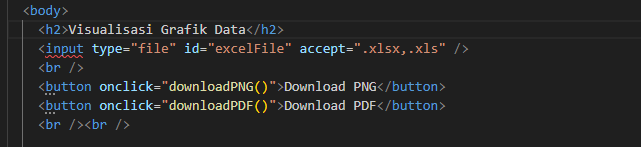
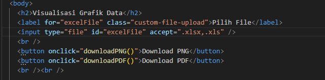

# Aplikasi Visualisasi Grafik Data

- Marchelino Senduk Kaunang (10241040) (100%)
- Adelia Cyntia Renata (10241003) (100%)
- Devina Dian Saputri (10241022) (100%)
- Muhammad Yuspa Ardiansyah (10241052) (100%)
- Siti Inayah Wulandari (10241068) (100%)

## Pendahuluan
Dengan bantuan grafik, data yang kompleks dan besar dapat disederhanakan menjadi bentuk yang mudah dipahami, seperti diagram batang, grafik garis, pie hart, dan scatter plot. Visualisasi tidak hanya membantu dalam mengenali pola, tren, dan hubungan antar data tetapi juga meningkatkan komunikasi dan pengambilan informasi yang tersedia.
Visualisasi data ada pada ribuan tahun yang lalu, salah satu pelopor visualisasi data adalah william Playfair, seorang ekonom asal skotlandia pada akhir abad ke-18 memperkenalkan grafik batang, grafik garis, dan pie chart sebagai cara untuk menyajikan data ekonomi dan perdagangan. Diabad ke-19, Florence Nightingale menggunakan diagram plar area untuk menunujukkan data statistik kesehatan selama perang krinea, yang kemudian membantu meningkatkan sistem pelayanan kesehatan. Visualisasi data mengacu pada teknik yangdigunakan untuk mengkomunikasi data atau informasi dengan membuatnya sebagai objek visual dalam grafik. Tujuan kami membuat program visualisasi grafik data adalah untuk menyajikan data dalam bentuk visualisasi dan interaktif serta menyederhanakan penyajian informasi secara interaktif dan mudah dimengerti.

## Tinjauan Pustaka
Dalam pembuatan aplikasi visualisasi grafik data berbasis web, kami menemukan beberapa penelitian dan program serupa yang memiliki tujuan yang hampir sama, yaitu Program-program ini menggunakan teknologi yang sama seperti Chart.js, SheetJS, dan jsPDF untuk menampilkan serta mengelola data dalam bentuk grafik interaktif. 

Salah satu contoh program yang mirip adalah Dashboard Kumpulan Chart.js yang dikembangkan oleh Burhanuddin (2023). Dalam proyek ini, Burhanuddin menyusun berbagai jenis grafik seperti grafik batang (bar chart), pie chart, dan line chart menggunakan pustaka Chart.js. Data dalam program ini dimasukkan langsung dalam kode JavaScript tanpa integrasi pembacaan file Excel. Namun, dari segi tampilan antarmuka dan fungsi visualisasi, program tersebut memiliki kemiripan dengan program kami, yaitu menyajikan data statistik dalam bentuk grafik secara interaktif (Burhanuddin, 2023). 

Contoh lainnya dapat ditemukan dalam dokumentasi resmi Jspreadsheet, sebuah pustaka spreadsheet berbasis web yang terintegrasi langsung dengan Chart.js. Dalam dokumentasi tersebut, ditunjukkan contoh implementasi di mana data dari tabel online dapat langsung divisualisasikan ke dalam grafik menggunakan Chart.js. Meskipun data tidak diambil dari file Excel, pendekatan visualisasi dan interaktivitas yang digunakan sangat mirip dengan aplikasi kami (Jspreadsheet, 2024). 

Banyak juga proyek di GitHub dan CodePen yang membagikan contoh visualisasi data menggunakan kombinasi SheetJS, Chart.js, dan jsPDF. Kombinasi ini memungkinkan pengguna untuk mengunggah file Excel, mengubah data menjadi format JSON, menampilkannya dalam bentuk grafik menggunakan Chart.js, dan mengekspornya sebagai file PDF menggunakan jsPDF. Dokumentasi resmi dari SheetJS dan jsPDF juga memberikan tutorial lengkap yang relevan dengan aplikasi kami (SheetJS, 2024; jsPDF, 2024). Beberapa pengguna bahkan mempublikasikan template sederhana sebagai referensi dalam pembuatan aplikasi berbasis web yang menangani data Excel. 

Program kami menggabungkan semua pendekatan dari referensi di atas ke dalam satu antarmuka yang utuh, di mana pengguna dapat mengunggah file Excel, melihat grafik yang dihasilkan, dan mengunduh grafik tersebut sebagai file gambar atau PDF. Kami juga menambahkan sentuhan desain menggunakan CSS3 dan Google Fonts agar tampilan lebih menarik dan ramah pengguna. Dengan melihat banyaknya program yang memiliki pendekatan serupa, kami dapat menyimpulkan bahwa metode yang kami gunakan termasuk metode umum dan efektif dalam pengembangan aplikasi visualisasi data berbasis web. 

- Burhanuddin, 04. (2023). Dashboard Kumpulan Chart.js. GitHub Repository.

- Jspreadsheet. (2024). Spreadsheet charts with ChartJS.
  
- Chart.js. (2024). Chart.js Examples.  

- SheetJS. (2024). Excel to JSON Example. 

- jsPDF. (2024). jsPDF GitHub Repository. 


## Metode Pembuatan
Pada program yang telah kami buat adalah **Aplikasi Visualisasi Grfaik Data** berbasis web yang menggunakan **Chart.js** untuk membuat grafik, serta mendukung import data dari file Excel (.xlsx/.xls) dan pengguna dapat mengekspor grafik ke dalam bentuk PNG atau PDF. Bagian pertama HTML, yaitu head yang berisi judul halaman, pengaturan responsif, serta beberapa library eksternal. Diantaranya ada Chart.js untuk menggambar grafik, SheetJS untuk scan/membaca file excel, dan jsPDF untuk mengekspor grafik ke dalam bentuk file PDF. Pada bagian body, ada judul aplikasi "Visualisasi Grafik Data", ada label dan input file untuk pengguna memasukkan file excel (.xlsx/.xls). Setelah file dimasukkan, pengguna bisa memilih tombol untuk mengekspor grafik dalam bentuk PNG atau PDF. Pada bagian canvas dengan ID **chartCanvas** untuk sebagai tempat Chart.js menampilkan grafik. Grafik yang ditampilkan berdasarkan dari file excel yang di proses oleh JavaScript. Bagian ini kami menggunakan beberapa library seperti:
- **https://cdn.jsdelivr.net/npm/chart.js**
  Chart.js ini merupakan library yang berfungsi untuk membuat grafik, seperti grafik garis, batang, pie, dan lainnya. Chart.js ini digunakan pada elemen canvas dari data yang telah diinputkan.
- **https://cdnjs.cloudflare.com/ajax/libs/xlsx/0.18.5/xlsx.full.min.js**
  SheetJS atau xlsx.js merupakan library yang berfungsi untuk scan, membaca, memproses, dan konversi data dari file excel (.xlsx/.xls).
- **https://cdnjs.cloudflare.com/ajax/libs/jspdf/2.5.1/jspdf.umd.min.js**
  jsPDF merupakan library yang berfungsi untuk membuat dan mengekspor grafik dari Chart.js lalu mengubahnya menjadi bentuk file PDF.

Pada Bagian tampilan web (css) kami menggunakan font dari Google Fonts yaitu "Poppins" dan kami menggunakan fitur dari CSS3. Latar belakang halaman menggunakan gradasi biru mudah ke putih, judul halaman diberi hijau kebiruan yang kontras. Button untuk "Download PNG" dan "Download PDF" diberi warna hijau toska. Bagian kanvas yang digunakan untuk menampilkan grafik dari Chart.js juga diperindah. Kanvas diberi latar belakang putih dengan sudut yang membulat dan bayangan halus di sekelilingnya. Ini membuat grafik tampak seperti berada di dalam sebuah kartu atau panel, sehingga tampil lebih elegan dan mudah dipisahkan dari latar belakang halaman. Penataan posisi grafik juga diatur menggunakan Flexbox agar tampil tepat di tengah layar.

```js
button {
  ...
  background-color: #009688;
  ...
}
button:hover {
  background-color: #00796b;
}
```

Pada bagian canvas menampilkan grafik diberi warna latar belakang putih.

```js
canvas {
  margin-top: 30px;
  background-color: white;
  border-radius: 12px;
  box-shadow: 0 4px 16px rgba(0, 0, 0, 0.1);
}
```
Ada beberapa library dan Tools yang digunakan:
- Google Fonts
  Digunakan untuk mengimpor dan menerapkan font "Poppins" ke seluruh elemen teks. Ini termasuk ke dalan web typography tool dari google.
- CSS3
  Digunakan untuk mengatur layout, warna, transisi, dan efek.

Pada bagian javascript dibuat sebagai bagian yang dapat membaca file excel, menampilkan dalam bentuk grafik menggunakan Chart.js serta ada fitur mengekspor grafik ke dalam bentuk format PNG maupun dokumen PDF. Proses pertama dari elemen **canvas** yang memiliki ID **chartcanvas** dan menginisialisasi gambar 2D untuk bisa digunakan Chart.js untuk menggambar grafik. Pada variabel chart berfungsi untuk bisa menghapus file yang sebelumnya diinputkan kemudian diinputkan kembali file yang baru agar tidak terjadi duplikat grafik pada saat file excel diinputkan lebih dari satu kali. Lalu kami membuat event listener yang digunakan untuk mengecek pada saat pengguna memilih file lalu menginputkan file (input type="file"), apabila pengguna telah menginputkan file maka **FileReader** yaitu API JavaScript yang berfungsi membaca file lokal yang telah diinputkan oleh pengguna tanpa menyimpan di server. File yang diinputkan di baca pada format **ArrayBuffer** lalu akan di eksekusi oleh SheetJS. Pada event **onload**, kami menggunakan library SheetJS (xlsx.js) berfungsi untuk membaca file excel yang telah diinputkan. Data excel dibaca sebagai **Uint8Array** lalu di konversi menjadi format workbook oleh fungsi **XLSX.read**, lalu dari lembar pertama workbook dipilih kemudian diubah menjadi objek array JSON menggunakan **XLSX.utils.sheet_to_json** dari setiap objek dalam array mewakili satu baris di excel dengan key sebagai kolom. Pada kolom pertama dijadikan sebagai sumbu-X dan kolom kedua dijadikan sebagai sumbu-Y. Kedua array ini, **labels** dan **values** akan dikonversi menjadi grafik. Sebelum membuat grafik, program akan memeriksa atau mengecek apakah sudah ada grafik yang telah dibuat sebelumnya. Jika ada, grafik yang sebelumnya akan di eksekusi oleh fungsi **chart.destroy()**. Lalu library **Chart.js** akan mengeksekusi menggambar grafik batang (type:'bar'). Selanjutnya, kami membuat dua fungsi fitur ekspor yang pertama fungsi **downloadPNG()** yang berfungsi untuk menyimpan gambar grafik dengan format PNG. Fungsi ini memuat elemen **a** dengan mengambil data dari canvas dalam format DataURL, lalu pengguna dapat mengunduhnya dengan nama file **'grafik-excel.png'**. Fungsi yang berikutnya ada fungsi **downloadPDF()** yang menggunakan library **jsPDF**, fungsi **new jsPDF()** ini berfungsi untuk membuat file dokumen PDF kosong, lalu mengambil atau menangkap gambar dari elemen **a** dan menambahkannya ke dalam dokumen menggunakan fungsi **addImage**, lalu PDF dapat diunduh dan disimpan di perangkat dengan nama file **'grafik-excel.pdf'**. Pada bagian Javascript, kami menggunakan beberapa library dan tools seperti berikut:

- FileReader API
  Tools yang telah disediakan oleh Javascript yang berfungsi membaca/menangkap file dari pengguna
- SheetJS (XLSX.js)
  Library ini berfungsi untuk melakukan proses file excel dan mengkonversinya menjadi data JSON.
- Chart.js
  Library yang digunakan untuk mengambil dan membuat grafik dari data excel.
- jsPDF
  Tools yang berfungsi untuk mengekspor grafik ke dalam bentuk dokumen PDF.


## Hasil Program
Pada saat pembuatan terdapat syntax yang error pada HTML bagian body dikarenakan mungkin Plugin HTML linter salah mendeteksi isi tag sebagai invalid. Adanya ekstensi yang menganggap kombinasi atribut seperti accept=".xlsx,.xls" kurang lengkap, atau tidak sesuai dengan standar ketat HTML5 (meskipun sebenarnya valid). VS Code belum mengenali elemen karena belum lengkap struktur HTML-nya (misal belum ada **html**, **head**, dan **body**)



Jadi, kami mendapatkan solusi dan memperbaiki nya dengan dengan membuat syntax **label** Dalam hal ini, label digunakan sebagai pengganti visual dari input file, dan ketika pengguna mengklik label tersebut, browser akan secara otomatis membuka dialog pemilihan file karena label tersebut terhubung ke input melalui atribut for yang merujuk pada id milik input. Serta memudahkan untuk mengatur style pada tempat menginputkan file excel.



## Kesimpulan
Adapun hasil akhir dari laporan ini, dapat disimpulkan bahwa aplikasi visualisasi data berbasis web ini memudahkan pengguna dalam mengubah data dari file Excel menjadi sebuh grafik yang jelas dan mudah dimengerti. Di mana pada bagian JavaScript kmai menggunakan Chart.js untuk menampilkan data yang berasal dari exel menjadi sebuah grafik, lalu adapula SheetJS yang digunakan untuk membaca file Exel yang diberikan, dan yang terakhir ada JsPDF sebuah fitur mengekspor grafik ke dalam bentuk format PNG maupun dokumen PDF.

Aplikasi visualisasi data berbasis web yang kami buat memiliki beberapa keunggulan, seperti:
1. Mendukung impor file Exel(.xlsx/.xls) tanpa mengubah format terlebih dahulu
2. Menampilkan sebuah visualisasi yang mudah dibaca, data yang dimasukkan akan otomatis berubah dan ditampilkan dalam bentuk sebuah grafik batang yang mudah dipahami
3. Adanya fitur ekspor ke PNG dan PDF, data yang sudah ditampilkan dalam bentuk grafik bisa disimpan sebagai gambar(PNG) atau dokumen (PDF)
4. Tidak perlu instalasi, karena program berbasis web maka program ini bisa dijalankan langsung dari browser
5. Membantu dalam pengerjaan laporan ataupun presentasi, karena grafik yang ditampilkan bisa disimpan menjadi bentuk PDF ataupun PNG bisa langsung dimasukkan ke dalam laporan 

Kami berharap program ini dapat menjadi alat bantu visualisasi data yang praktis untuk digunakan, dan dapat terus dikembangkan lagi dengan fitur-fitur lainnya yang lebih menarik dan bemanfaat bagi pengguna.

## Daftar pustaka
- <div id="div_ref1"> 
    https://en.wikipedia.org/wiki/William_Playfair. Diakses tanggal 29 Mei 2025.
  </div>

- <div id="div_ref2"> 
    https://id.wikipedia.org/wiki/Visualisasi_data. Diakses tanggal 29 Mei 2025.
  </div>

- <div id="div_ref2"> 
    https://github.com/04burhanuddin/Dashboard-Kumpulan-Chart-JS. Diakses tanggal 5 Juni 2025.
  </div>
  
- <div id="div_ref2"> 
    https://jspreadsheet.com/docs/v8/examples/spreadsheet-with-charts. Diakses tanggal 5 Juni 2025.
  </div>

- <div id="div_ref2"> 
    https://www.chartjs.org/docs/latest/samples. Diakses tanggal 5 Juni 2025.
  </div>

  - <div id="div_ref2"> 
    https://docs.sheetjs.com. Diakses tanggal 5 Juni 2025.
  </div>

  - <div id="div_ref2"> 
    https://github.com/parallax/jsPDF. Diakses tanggal 5 Juni 2025.
  </div>

  
